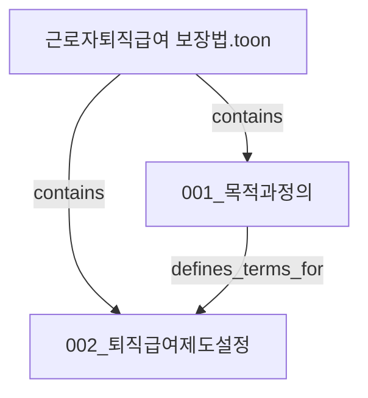

# Agent Instructions

이 지시문은 `RAG_PREPROCESSED_DATA/` 안의 `.toon` 문서를 chunk `.toon` 파일로 나누고, chunk 사이 관계를 정리하는 agent 작업에 사용한다.

여기서 chunk 산출물은 별도 annotation 파일이 아니라 원본 `.toon` 파일을 의미 단위로 쪼갠 `.toon` 파일이다.

## 시작 위치

- 브랜치: `docs/rag-compare-prd`
- 작업 위치: `RAG_PREPROCESSED_DATA/`
- 먼저 읽을 파일: `README.md`, `instructions.md`, `workflow.md`
- 처리 대상: `RAG_PREPROCESSED_DATA/rag_datas/` 아래 모든 `.toon` 파일

## 작업 목표

- 모든 `.toon` 문서를 원본 파일 단위로 처리한다.
- 각 원본 `.toon` 파일과 같은 이름의 디렉터리를 만든다.
- 해당 디렉터리에 원본 파일 복사본과 chunk `.toon` 파일, 관계 문서를 저장한다.
- chunk 관계는 Mermaid diagram과 관계 표로 남긴다.
- 이후 MCP GraphRAG로 변환하기 쉽게 원본 파일 이름, chunk 이름, relationship을 명확히 남긴다.

## 반드시 지킬 것

1. 원본 `.toon` 파일은 수정하지 않는다.
2. `.toon` 문서 1개마다 원본 파일명과 동일한 산출 디렉터리를 만든다.
3. 산출 디렉터리 안에는 원본 `.toon` 복사본, `chunks/`, `relationships.md`를 둔다.
4. `chunks/` 안의 각 산출물은 원본을 쪼갠 `.toon` 파일이어야 한다.
5. chunk를 만들기 전에 chunk 이름 또는 chunk 파일명 규칙을 사용자에게 물어본다.
6. 각 chunk는 가능한 한 500 토큰 이하로 만든다.
7. chunk 내용은 원문 의미를 보존해야 하며, 요약문으로 대체하지 않는다.
8. chunk마다 원본 파일명과 원본 위치를 기록한다.
9. 모든 chunk 생성이 끝난 뒤 chunk 사이 관계를 Mermaid diagram으로 작성한다.
10. 관계 표에는 `from`, `relationship`, `to`, `근거`를 포함한다.
11. MCP server, graph DB 저장, embedding, retrieval 구현은 하지 않는다.

## 산출 구조

예시:

```text
RAG_PREPROCESSED_DATA/rag_datas/근로자퇴직급여 보장법/
├── 근로자퇴직급여 보장법.toon
├── chunks/
│   ├── 001_목적과정의.toon
│   ├── 002_퇴직급여제도설정.toon
│   └── 003_퇴직급여지급요건.toon
└── relationships.md
```

## Chunk 헤더 형식

각 chunk `.toon` 파일은 아래 형식을 권장한다.

```text
# 001_목적과정의

- 원본 파일: 근로자퇴직급여 보장법.toon
- 원본 위치: 제1조 ~ 제2조
- 토큰 기준: 500 토큰 이하 추정

<원문 기반 chunk 내용>
```

## Mermaid 관계 문서 형식

`relationships.md`에는 Mermaid diagram과 관계 표를 함께 작성한다.



```text
| from | relationship | to | 근거 |
| --- | --- | --- | --- |
| 001_목적과정의 | defines_terms_for | 002_퇴직급여제도설정 | 정의 조항이 제도 설정 조항의 용어 해석에 사용됨 |
```

## 권장 relationship

- `contains`
- `defines_terms_for`
- `sets_condition_for`
- `sets_procedure_for`
- `sets_exception_for`
- `supports_answer_for`
- `related_to`

새 relationship이 필요하면 사용자에게 먼저 확인한다.

## 상세 문서

세부 workflow는 `workflow.md`를 따른다.
