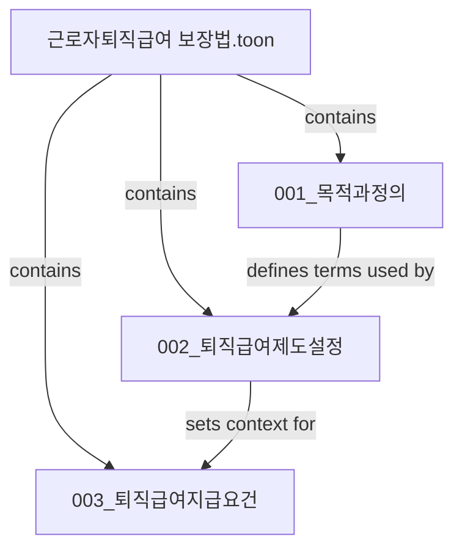

# RAG_PREPROCESSED_DATA Chunk Workflow

이 문서는 `RAG_PREPROCESSED_DATA/` 안의 `.toon` 문서를 사람이 검토하고, AI agent에게 chunk 생성과 관계 정리를 맡길 때 따라야 할 작업 흐름을 정의한다.

현재 범위는 `.toon` 문서를 chunk 단위로 정리하고 chunk 사이의 관계를 Mermaid diagram으로 기록하는 것이다. 이 결과를 MCP 형태의 GraphRAG로 감싸는 작업은 이후 단계이며, 이 workflow의 범위가 아니다.

## 1. 핵심 목적

- `.toon` 원본 문서를 보존한 상태에서 사람이 검토 가능한 chunk 산출물을 만든다.
- 각 chunk는 가능한 한 500 토큰 이하로 만든다.
- chunk 사이의 관계를 원본 파일명, chunk 이름, relationship이 드러나는 Mermaid diagram으로 기록한다.
- 이후 MCP GraphRAG memory/graph 저장소로 옮길 수 있도록 파일명과 관계 표현을 일관되게 유지한다.

## 2. 처리 대상

대상은 `RAG_PREPROCESSED_DATA/` 아래 모든 `.toon` 파일이다.

예시:

```text
RAG_PREPROCESSED_DATA/rag_datas/근로자퇴직급여 보장법.toon
RAG_PREPROCESSED_DATA/rag_datas/조례/고령자_조례/부산광역시 수영구/부산광역시 수영구 공동주택 고령자경비원의 고용 유지 및 창출 촉진을 위한 지원 조례.toon
```

## 3. 문서별 chunk 생성 규칙

`.toon` 문서 1개를 처리할 때마다 원본 파일과 같은 이름의 디렉터리를 만든다.

예시:

```text
원본:
RAG_PREPROCESSED_DATA/rag_datas/근로자퇴직급여 보장법.toon

산출 디렉터리:
RAG_PREPROCESSED_DATA/rag_datas/근로자퇴직급여 보장법/
```

산출 디렉터리 안에는 다음 파일을 둔다.

```text
근로자퇴직급여 보장법/
├── 근로자퇴직급여 보장법.toon      # 원본 파일 복사본
├── chunks/
│   ├── 001_<chunk_name>.toon
│   ├── 002_<chunk_name>.toon
│   └── ...
└── relationships.md
```

작업자는 chunk를 만들기 전에 반드시 사용자에게 chunk 이름 규칙을 물어본다.

질문 예시:

```text
이 문서의 chunk 파일명은 어떤 기준으로 지정할까요?
예: 001_목적과정의, 002_퇴직급여제도설정, 003_지급요건
```

사용자가 문서별 chunk 이름을 직접 지정하면 그 이름을 따른다. 사용자가 전체 규칙만 지정하면 `001_<의미단위요약>` 형식으로 생성하되, 애매한 경우 다시 확인한다.

## 4. Chunk 작성 기준

각 chunk는 다음 기준을 따른다.

- 가능한 한 500 토큰 이하로 유지한다.
- 조문, 항, 호, 별표, 부칙처럼 법령 구조가 갈리는 지점은 무리하게 합치지 않는다.
- 한 chunk 안에는 하나의 주된 법적 의미 또는 절차가 들어가도록 한다.
- 원문 문장을 임의로 바꾸지 않는다.
- 필요한 경우 chunk 상단에 원본 위치를 짧게 표시한다.
- 토큰 수를 정확히 계산할 수 없으면 문단 길이를 보수적으로 줄이고 `500 토큰 이하 추정`으로 기록한다.

권장 chunk 헤더:

```text
# 001_목적과정의

- 원본 파일: 근로자퇴직급여 보장법.toon
- 원본 위치: 제1조 ~ 제2조
- 토큰 기준: 500 토큰 이하 추정

<원문 기반 chunk 내용>
```

## 5. 관계 정리 규칙

모든 `.toon` 문서의 chunk 생성이 끝난 뒤 chunk 사이의 관계를 찾는다.

관계 정리는 각 문서 디렉터리의 `relationships.md`에 작성한다. 문서 내부 관계를 먼저 정리하고, 필요한 경우 문서 간 관계는 상위 디렉터리에 별도 `relationships.md`를 둔다.

Mermaid diagram에는 다음 정보를 포함한다.

- 원본 파일 이름
- chunk 이름
- chunk 사이 relationship
- 관계 방향
- 관계 근거가 되는 짧은 이유

예시:



Mermaid 아래에는 관계 목록을 표로 다시 적는다.

```text
| from | relationship | to | 근거 |
| --- | --- | --- | --- |
| 001_목적과정의 | defines_terms_for | 002_퇴직급여제도설정 | 정의 조항이 제도 설정 조항의 용어 해석에 사용됨 |
```

## 6. 권장 relationship type

초기에는 너무 복잡한 taxonomy를 만들지 않는다. 다음 타입을 우선 사용한다.

| relationship | 의미 |
| --- | --- |
| `contains` | 원본 파일이 chunk를 포함 |
| `defines_terms_for` | 한 chunk가 다른 chunk의 용어 정의를 제공 |
| `sets_condition_for` | 한 chunk가 다른 chunk의 적용 조건을 제공 |
| `sets_procedure_for` | 한 chunk가 절차 또는 신청 흐름을 제공 |
| `sets_exception_for` | 예외, 제외, 특례 조건을 제공 |
| `supports_answer_for` | 특정 질문 답변의 근거가 됨 |
| `related_to` | 명확한 세부 관계를 아직 정하지 못한 관련성 |

새 relationship type이 필요하면 임의로 추가하지 말고 사용자에게 확인한다.

## 7. AI agent에게 맡길 때의 진행 순서

1. 처리할 `.toon` 파일 경로를 확인한다.
2. 같은 이름의 산출 디렉터리가 이미 있는지 확인한다.
3. 기존 산출물이 있으면 덮어쓰기 전에 사용자에게 확인한다.
4. chunk 파일명 규칙 또는 chunk 이름 목록을 사용자에게 묻는다.
5. 원본 `.toon` 파일을 산출 디렉터리에 복사한다.
6. `chunks/` 디렉터리를 만든다.
7. 500 토큰 이하를 목표로 의미 단위 chunk를 만든다.
8. chunk마다 원본 파일명과 원본 위치를 기록한다.
9. 모든 `.toon` 문서의 chunk 생성이 끝난 뒤 관계 분석을 시작한다.
10. Mermaid diagram과 관계 표를 `relationships.md`에 작성한다.
11. MCP GraphRAG 변환이나 server wrapping은 진행하지 않는다.

## 8. 금지 사항

- 원본 `.toon` 파일을 수정하지 않는다.
- 기존 chunk 산출물을 사용자 확인 없이 덮어쓰지 않는다.
- chunk를 만들면서 원문 의미를 요약문으로 대체하지 않는다.
- relationship을 확신할 수 없는데 확정 관계처럼 표시하지 않는다.
- MCP server, graph DB 저장, embedding, retrieval 구현을 이 단계에서 진행하지 않는다.
- `RAG_PREPROCESSED_DATA/` 전체 데이터 파일을 무작정 git add 하지 않는다.

## 9. 완료 기준

문서 1개 기준 완료 상태:

- 원본 파일명과 같은 디렉터리가 존재한다.
- 해당 디렉터리에 원본 `.toon` 복사본이 있다.
- `chunks/` 아래에 사용자 확인을 거친 chunk 파일들이 있다.
- 각 chunk는 500 토큰 이하를 목표로 작성되어 있다.
- `relationships.md`에 Mermaid diagram과 관계 표가 있다.

전체 완료 상태:

- `RAG_PREPROCESSED_DATA/` 아래 모든 `.toon` 문서가 위 기준을 만족한다.
- 문서 간 연결이 필요한 경우 상위 `relationships.md`에 cross-document 관계가 정리되어 있다.
- 이후 MCP GraphRAG 작업자가 사용할 수 있도록 chunk 이름, 원본 파일 이름, relationship이 명확히 남아 있다.
