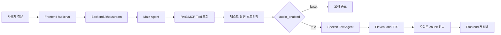

# 음성 답변 지연 시간 분석

## 결론

현재 지연은 ElevenLabs 하나 때문이 아닙니다. 사용자가 체감하는 대기 시간은 아래 세 구간이 합쳐져서 길어집니다.

| 구간 | 현재 역할 | 지연 영향 |
|---|---|---:|
| Main Agent + RAG | 답변 전에 RAG/MCP tool로 근거 조회 | 첫 텍스트가 늦게 나오는 주된 원인 |
| Speech Text Agent | 최종 답변을 음성용 문장으로 다시 변환 | 음성 ON일 때 추가 LLM 호출 발생 |
| ElevenLabs TTS + 오디오 스트림 | 음성 파일 생성 후 base64 chunk를 프론트로 전달 | 전체 요청 완료 시간이 더 길어짐 |

가장 먼저 줄여야 할 부분은 "텍스트 답변 완료"와 "음성 생성 완료"를 분리하는 것입니다. 텍스트 답변이 끝나면 사용자는 바로 다음 질문을 할 수 있게 하고, 음성은 별도 상태로 뒤따라오게 만드는 방식이 체감 속도 개선에 가장 효과적입니다.

## 현재 동작 흐름



현재 구조에서는 텍스트 답변이 먼저 보이더라도, 음성 ON 상태에서는 오디오 chunk와 `audio_done`까지 끝난 뒤 전체 스트림이 완료됩니다. 그래서 사용자는 답변을 봤는데도 입력창이 계속 처리 중인 것처럼 느낄 수 있습니다.

## 측정 환경

| 항목 | 값 |
|---|---|
| 실행 방식 | `cd deploy/makefile && make up` |
| Frontend | `http://127.0.0.1:3000/chat` |
| Backend | `http://127.0.0.1:8100` |
| RAG backend | `http://127.0.0.1:8110` |
| 측정 질문 | `기초연금 신청 조건을 짧게 알려줘.` |
| 반복 횟수 | 각 시나리오 3회 |

Health check는 모두 빠르게 응답했습니다. 따라서 기본 서버 연결 자체가 병목은 아닙니다.

| 대상 | HTTP | 응답 시간 |
|---|---:|---:|
| Frontend `/chat` | 200 | 0.003s |
| Backend `/health` | 200 | 0.002s |
| RAG `/health` | 200 | 0.001s |

## 전체 응답 속도 측정 결과

아래 값은 3회 측정 평균입니다.

| 사용자 체감 구간 | 음성 OFF | 음성 ON |
|---|---:|---:|
| 스트림 연결 시작 | 1.08s | 1.05s |
| 첫 답변 텍스트 표시 | 5.67s | 5.25s |
| 텍스트/요청 완료 | 8.78s | 11.42s |
| Speech Text 완료 | 없음 | 10.09s |
| 첫 오디오 도착 | 없음 | 10.35s |
| 오디오 완료 | 없음 | 11.42s |

백엔드 직접 호출 기준으로는 음성 ON에서 아래와 같은 흐름이 확인됐습니다.

```text
1.24s  RAG/tool 시작
5.69s  RAG/tool 처리 진행
6.85s  첫 답변 텍스트
8.10s  최종 텍스트
10.30s Speech Text 완료
10.57s 첫 오디오 도착
11.36s 오디오 완료
```

## 왜 지연되는가

### 1. 첫 텍스트 전까지 RAG/tool 호출이 여러 번 발생함

Main Agent system prompt는 답변 전에 RAG/MCP tool로 근거를 조회하도록 되어 있습니다. 이 정책은 답변 신뢰도에는 필요하지만, 첫 텍스트가 나오기 전까지 tool 왕복 시간이 쌓입니다.

측정 중에는 첫 답변 텍스트가 나오기 전에 tool event가 여러 번 발생했습니다.

```text
1.24s tool_call
2.20s tool_call
3.17s tool_call
3.98s tool_call
5.12s tool_call
5.69s tool_call
6.85s first delta
```

즉, 첫 답변 지연의 핵심은 프론트 렌더링 문제가 아니라 Main Agent가 RAG 근거를 찾고 답변을 생성하기까지의 시간입니다.

### 2. 음성 ON에서는 최종 답변 뒤에 LLM 호출이 한 번 더 있음

현재 Speech Text Agent는 최종 답변을 음성으로 읽기 좋은 문장으로 바꾸기 위해 별도 LLM을 호출합니다.

```text
8.10s 최종 텍스트
10.30s Speech Text 완료
```

이 구간만 약 2초 이상 걸릴 수 있습니다. 답변에 마크다운, 목록, 출처가 많을수록 음성용 문장 변환 시간이 길어질 수 있습니다.

### 3. ElevenLabs TTS와 base64 오디오 전송이 전체 완료를 늦춤

ElevenLabs에서 음성 chunk가 오기 시작하면 프론트로 `data-audio` 이벤트를 계속 보냅니다. 이번 측정에서는 음성 ON일 때 평균 약 0.9MB, 약 600개 이상의 audio event가 발생했습니다.

| 항목 | 음성 ON 평균 |
|---|---:|
| 전송 bytes | 약 922KB |
| audio event 수 | 약 633개 |
| 첫 오디오 도착 | 10.35s |
| 오디오 완료 | 11.42s |

base64는 원본 바이너리보다 데이터가 커지고, chunk 이벤트가 너무 많으면 프론트 스트림 처리 부담도 커집니다.

### 4. 프론트는 오디오 완료까지 스트림을 완료하지 않음

프론트 `createBackendUiMessageStream`은 백엔드 스트림을 끝까지 읽은 뒤 `finish`를 보냅니다. 그래서 음성 ON에서는 텍스트가 먼저 보이더라도 오디오가 끝날 때까지 전체 요청 상태가 길어집니다.

## 지연 시간 단축 방법

### 1순위: 텍스트 답변 완료와 음성 생성을 분리

가장 효과가 큰 개선입니다.

현재:

```text
질문 -> RAG -> 텍스트 답변 -> Speech Text -> TTS -> audio_done -> 요청 완료
```

개선:

```text
질문 -> RAG -> 텍스트 답변 -> 요청 완료
                         \
                          -> 별도 음성 생성 -> 재생바 업데이트
```

기대 효과:

| 항목 | 현재 | 개선 후 기대 |
|---|---:|---:|
| 음성 ON 전체 완료 | 약 11.42s | 텍스트 완료 기준 약 8초대 |
| 다음 질문 가능 시점 | 오디오 완료 후 | 텍스트 답변 완료 후 |
| 사용자 체감 | 답변 후에도 계속 기다림 | 답변은 먼저 보고, 음성은 준비 중으로 인식 |

구현 방향:

| 영역 | 작업 |
|---|---|
| Backend | `/chat/stream`은 텍스트 답변 완료까지만 책임지게 변경 |
| Backend | `/chat/audio` 또는 별도 SSE endpoint로 speech/TTS 분리 |
| Frontend | 텍스트 메시지 상태와 음성 준비 상태를 분리 |
| Frontend | 답변 아래 또는 입력창 아래에 `음성 준비 중` 표시 |
| Frontend | 음성 생성이 끝나면 재생바에 audio source 연결 |

주의할 점:

- 텍스트 답변이 완료되어도 음성은 실패할 수 있으므로, 음성 실패가 채팅 답변 실패로 이어지면 안 됩니다.
- 음성 OFF 상태에서는 지금처럼 speech/TTS를 아예 호출하지 않는 흐름을 유지해야 합니다.

### 2순위: Speech Text Agent LLM 호출 줄이기

Speech Text Agent는 마크다운, 목록, 링크, 코드 표시를 자연스러운 한국어 음성 문장으로 바꾸는 역할입니다. 하지만 모든 답변마다 LLM을 한 번 더 호출하면 지연이 커집니다.

개선안:

| 방식 | 설명 | 효과 |
|---|---|---:|
| 로컬 sanitizer 우선 | 마크다운 기호, 링크, 코드, bullet을 규칙 기반으로 제거 | LLM 호출 제거 가능 |
| 긴 답변만 LLM 사용 | 표/목록이 복잡하거나 긴 답변만 speech_text LLM 호출 | 평균 지연 감소 |
| 음성용 글자 수 제한 | TTS로 읽을 문장을 700~1000자 수준으로 제한 | TTS 시간과 비용 감소 |
| `LLM_SPEECH_TEXT_MAX_TOKENS` 설정 | 음성 변환 출력 길이를 제한 | 과도한 생성 방지 |

추천 구조:

```text
최종 답변
  -> 로컬 sanitizer 적용
  -> 너무 길거나 구조가 복잡한 경우에만 Speech Text LLM 호출
  -> TTS
```

### 3순위: RAG/tool 호출 최적화

첫 텍스트가 늦게 나오는 가장 큰 이유는 RAG/tool 조회입니다. 근거 기반 답변을 유지하면서 호출 횟수와 왕복 시간을 줄여야 합니다.

개선안:

| 개선 | 설명 |
|---|---|
| tool timing log 추가 | 어떤 tool이 몇 초 걸리는지 `turn_id`, `tool_name`, `elapsed_ms`로 기록 |
| 반복 검색 방지 | 같은 키워드 검색을 반복하지 않도록 agent prompt/tool policy 정리 |
| query 결과 캐싱 | 동일 질문/동일 키워드의 RAG 결과를 짧은 TTL로 캐싱 |
| tool timeout 현실화 | 긴 timeout은 장애 시 대기 시간을 늘리므로 tool별 timeout 분리 |
| 검색 depth 제한 | 간단한 질문은 graph traversal 범위를 제한 |
| 답변 길이 제한 | 짧게 답하라는 요청에서는 main answer token을 제한 |

권장 목표:

| 지표 | 현재 평균 | 1차 목표 |
|---|---:|---:|
| 첫 답변 텍스트 | 5.67s | 4.0s 이하 |
| 텍스트 완료 | 8.78s | 6.0s 이하 |

### 4순위: 오디오 전송 방식 개선

현재는 많은 base64 chunk를 SSE data event로 전달합니다. 구현은 단순하지만, payload가 커지고 chunk 수가 많아질 수 있습니다.

개선안:

| 방식 | 장점 | 주의점 |
|---|---|---|
| chunk 묶어서 전송 | event 수 감소 | 첫 오디오 도착은 약간 늦어질 수 있음 |
| 음성 파일 URL 방식 | 프론트 스트림 payload 감소 | 파일 저장소나 임시 URL 관리 필요 |
| 낮은 bitrate/샘플레이트 검토 | 전송량 감소 | ElevenLabs 지원 포맷 확인 필요 |
| 답변 일부만 음성화 | TTS 시간과 전송량 감소 | 사용자가 기대하는 내용이 빠지지 않게 해야 함 |

### 5순위: 구간별 timing event/log 추가

현재는 외부에서 스트림 이벤트를 보고 측정했습니다. 운영 중에는 코드 내부에서 구간별 시간을 직접 남기는 편이 좋습니다.

추천 로그 필드:

| 필드 | 예시 |
|---|---|
| `turn_id` | `abc123` |
| `session_id` | `chat-session-1` |
| `phase` | `main_agent_start`, `first_delta`, `final`, `speech_text_done`, `first_audio`, `audio_done` |
| `elapsed_ms` | `6850` |
| `tool_name` | `memgraph_read_query` |
| `audio_enabled` | `true` |
| `byte_length` | `2048` |

예시:

```json
{
  "event": "chat_timing",
  "turn_id": "abc123",
  "phase": "first_delta",
  "elapsed_ms": 6850,
  "audio_enabled": true
}
```

이 로그가 있어야 "RAG가 느린지", "LLM이 느린지", "TTS가 느린지", "프론트 전송이 느린지"를 매번 분리해서 볼 수 있습니다.

## 추천 작업 순서

| 순서 | 작업 | 난이도 | 효과 |
|---:|---|---|---|
| 1 | timing log/event 추가 | 낮음 | 병목 추적 가능 |
| 2 | 텍스트 finish와 음성 생성 분리 | 중간 | 체감 속도 크게 개선 |
| 3 | Speech Text 로컬 sanitizer 추가 | 중간 | 음성 ON 지연 감소 |
| 4 | RAG/tool 호출 횟수와 timeout 튜닝 | 중간 | 첫 텍스트 시간 단축 |
| 5 | 오디오 payload 전송 방식 개선 | 중간~높음 | 음성 완료 시간/부하 감소 |

## 구현 체크리스트

### Backend

- [ ] `ChatGraphRunner`에 turn별 stopwatch 추가
- [ ] `main_agent_start`, `first_delta`, `final`, `speech_text_done`, `first_audio`, `audio_done` timing log 추가
- [ ] `/chat/stream`에서 텍스트 답변 완료와 음성 생성 완료를 분리할 수 있는 구조 검토
- [ ] 별도 `/chat/audio` 또는 `/chat/audio/stream` endpoint 추가 검토
- [ ] Speech Text 로컬 sanitizer 추가
- [ ] `LLM_SPEECH_TEXT_MAX_TOKENS`, `LLM_CHAT_MAX_TOKENS` 운영값 검토
- [ ] RAG tool별 elapsed time 로깅

### Frontend

- [ ] 채팅 message status와 audio status 분리
- [ ] 텍스트 답변 완료 후 입력창 busy 해제
- [ ] 음성 생성 중에는 재생바에 `준비 중` 표시
- [ ] 음성 실패 시 답변은 유지하고 재생바에만 실패 상태 표시

### Deploy/Env

- [ ] 음성용 LLM max token env 설정 검토
- [ ] ElevenLabs output format 변경 가능 여부 확인
- [ ] RAG tool timeout 운영값 검토

## 최종 권장안

1. 먼저 timing log를 넣어 병목을 코드 내부에서 확인합니다.
2. 그 다음 텍스트 답변 완료와 음성 생성을 분리합니다.
3. 이후 Speech Text Agent를 로컬 sanitizer 우선 방식으로 바꿉니다.
4. 마지막으로 RAG/tool 호출 횟수와 오디오 전송량을 줄입니다.

이 순서가 가장 안전합니다. 답변 품질을 크게 건드리지 않으면서 사용자가 기다리는 시간을 먼저 줄일 수 있기 때문입니다.
