# CI/CD Pipeline

```mermaid
flowchart LR
    Dev["Developer / PR reviewer"] --> PR["GitHub PR"]
    PR --> Merge["Merge to main"]

    subgraph GitHub["GitHub"]
        Merge --> Repo["SKNETWORKS-FAMILY-AICAMP/SKN28-3rd-1Team<br/>branch: main"]
    end

    subgraph CodePipeline["AWS CodePipeline V2<br/>skn28-container-pipeline"]
        Repo --> Source["Source: GitHubSource<br/>CodeStarSourceConnection<br/>DetectChanges=true"]
        Source --> Artifact["S3 artifact bucket<br/>skn28-codepipeline-artifacts-133946907234-us-east-1"]
        Artifact --> Build["Build: skn28-container-build<br/>buildspec: deploy/aws/buildspec.yml"]
        Build --> ImageDefs["Build artifact<br/>deploy/aws/imagedefinitions/*.json"]
        ImageDefs --> DeployExternal["DeployExternalMcp<br/>runOrder 1"]
        DeployExternal --> DeployBackend["DeployBackend<br/>runOrder 2"]
        DeployBackend --> DeployFrontend["DeployFrontendMigration<br/>runOrder 3"]
    end

    subgraph CodeBuild["AWS CodeBuild<br/>Linux privileged Docker build"]
        Build --> BuildBackend["docker build backend"]
        Build --> BuildFrontend["docker build frontend_migration"]
        Build --> BuildExternal["docker build external_mcp"]
    end

    subgraph ECR["Amazon ECR"]
        BuildBackend --> EcrBackend["skn28/backend:<commit12>"]
        BuildFrontend --> EcrFrontend["skn28/frontend-migration:<commit12>"]
        BuildExternal --> EcrExternal["skn28/external-mcp:<commit12>"]
    end

    subgraph ECS["Amazon ECS Fargate<br/>cluster: skn28-demo-cluster"]
        EcrExternal --> SvcExternal["service: skn28-demo-external-mcp"]
        EcrBackend --> SvcBackend["service: skn28-demo-backend"]
        EcrFrontend --> SvcFrontend["service: skn28-demo-frontend-migration"]
    end

    SvcExternal --> DoneExternal["task definition :9<br/>rollout completed"]
    SvcBackend --> DoneBackend["task definition :9<br/>rollout completed"]
    SvcFrontend --> DoneFrontend["task definition :9<br/>rollout completed"]
```

## Evidence

- Source: GitHub repository `SKNETWORKS-FAMILY-AICAMP/SKN28-3rd-1Team`, branch `main`.
- Pipeline: `skn28-container-pipeline`, type `V2`, `DetectChanges=true`.
- Build project: `skn28-container-build`, `aws/codebuild/standard:7.0`, privileged Docker build enabled.
- Buildspec: `deploy/aws/buildspec.yml`.
- ECR repositories: `skn28/backend`, `skn28/frontend-migration`, `skn28/external-mcp`.
- Deploy order: External MCP -> Backend -> Frontend Migration.
- Last verified deployed image tag: `01d62abe9e9d`.
