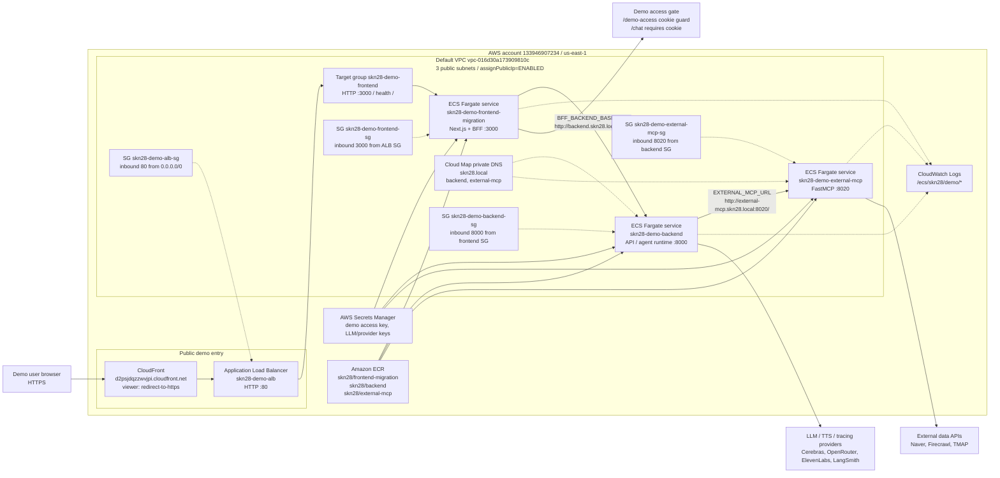

# Current AWS Runtime Architecture

## Security Notes

- Public entrypoint is CloudFront HTTPS, backed by the HTTP ALB origin.
- ALB only forwards to `frontend_migration`; backend and external MCP have no public load balancer.
- Service-to-service access is constrained by security groups: ALB -> frontend -> backend -> external MCP.
- Cloud Map private DNS names are `backend.skn28.local` and `external-mcp.skn28.local`.
- All three ECS services currently run one Fargate task each on task definition revision `:9`.
