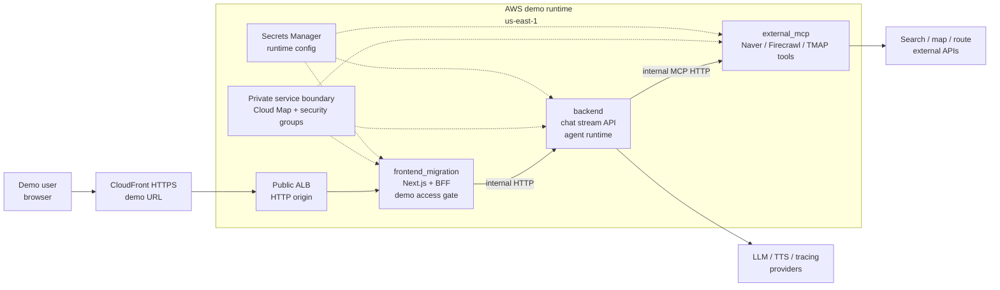

# Current AWS Runtime Architecture - Simplified

## Slide Notes

- Public user traffic enters through CloudFront HTTPS and reaches only the frontend service through the ALB.
- `frontend_migration` owns browser routes, `/demo-access`, and the BFF call into backend.
- `backend` and `external_mcp` are internal ECS services resolved through Cloud Map and constrained by security groups.
- Runtime secrets are injected from AWS Secrets Manager; no secret values are shown in this diagram.
