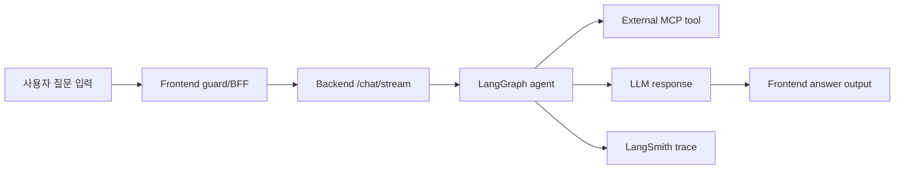

# 테스트 계획 및 결과 보고서

## 1. 작성 원칙

- 테스트 근거는 기존 자동화 테스트, Makefile 실행 결과, external_mcp blackbox 산출물, frontend/backend source guard 확인을 사용
- LangSmith metadata-only trace export를 관측 근거로 첨부
- token/API 비용 제약을 고려한 현실적 검증 범위 설정
- 이번 검증 범위 밖 항목을 후속 자동화 고도화 과제로 분류

## 2. 테스트 목표

이번 테스트 계획은 사용자가 질문을 입력한 뒤 backend agent, external MCP tool, frontend 출력까지 이어지는 핵심 경로를 검증하는 데 초점을 둔다.

검증 기준은 다음과 같다.

| 기준 | 확인 방법 | 판단 근거 | 판정 |
| --- | --- | --- | --- |
| 주요 기능 테스트 항목과 방법이 적절한가 | backend unittest, external_mcp unit/blackbox, frontend source guard/build/lint 근거를 구성요소별로 분리 | ✅ backend/external_mcp 자동화 테스트 존재<br>✅ external_mcp blackbox 테스트 존재<br>✅ frontend lint/build 및 source guard 확인<br>⚠️ frontend browser interaction 자동화는 후속 과제 | ✅ 제약 내 충족 |
| 질문 입력, API 요청, LLM 응답 출력이 실제 검증되었는가 | frontend 입력 guard, backend stream event test, external_mcp live/fake API, LangSmith trace 확인 | ✅ 질문 입력 방어 로직 확인<br>✅ MCP API 호출 결과 확인<br>✅ backend stream event 변환 확인<br>✅ LangSmith LLM/tool trace artifact 첨부<br>⚠️ final answer golden test는 후속 과제 | ✅ 제약 내 충족 |
| 빈 입력, 잘못된 요청, 응답 실패, 답변 불가 상황이 테스트되었는가 | backend validation/error path, MCP edge case, frontend fallback source guard 확인 | ✅ 빈 입력 처리 근거 존재<br>✅ MCP 실패/edge case 검증 존재<br>✅ frontend fallback source guard 확인<br>⚠️ browser 기반 실패 표시 검증은 후속 과제 | ✅ 제약 내 충족 |
| 테스트 결과, 발견 사항, 개선 방향이 명확한가 | 아래 결과/개선 표로 정리 | ✅ 실행 결과 수치 정리<br>✅ 성공/실패/차단 수 정리<br>✅ 커버리지 측정 범위 명시<br>✅ frontend 자동화 및 endpoint E2E 개선 항목 정리 | ✅ 충족 |

## 3. 실행 및 증거 수집

이번 보고서 작성 중 확인한 명령과 결과는 다음과 같다.

| 영역 | 명령 또는 증거 | 결과 |
| --- | --- | --- |
| Git 동기화 | `git pull origin main` | 최신 상태, `Already up to date.` |
| Backend unit | `cd backend && make test` | 40개 테스트 통과, 0 실패, 0.272s |
| Backend check | `cd backend && make check` | compile check 통과 |
| External MCP unit | `cd external_mcp && make test` | 23개 테스트 통과, 0 실패, 8.336s |
| External MCP check | `cd external_mcp && make check` | compile check 통과 |
| Frontend lint | `cd frontend_migration && make lint` | 통과 |
| Frontend build | `cd frontend_migration && make build` | 통과, Next build compile 12.4s, TS 16.7s, static pages 15/15 |
| External MCP blackbox artifact | `external_mcp/tests/blackbox/reports/mcp_blackbox_test_report.md` | 28개 계획/실행/성공, 실패 0, 차단 0 |
| LangSmith trace artifact | `presentation/testreport/langsmith/traces/*.jsonl` | metadata-only trace 18개, root trace 18/18 성공, 전체 run 603개 성공 |
| Evidence script | `python presentation/testreport/scripts/collect_test_evidence.py --repo . --out presentation/testreport/results/test_evidence_summary.json` | 근거 요약 JSON 생성 |

## 4. 전체 자동화 지표 요약

| 구성요소 | 포함한 검증 | 계획/실행/성공 | 실패/차단 | 실행 시간 | 비고 |
| --- | --- | ---: | ---: | --- | --- |
| Backend | unit test, compile check | 40/40/40 | 0/0 | unit 0.272s | `/chat/stream` HTTP E2E는 미포함 |
| External MCP | unit test, compile check | 23/23/23 | 0/0 | unit 8.336s | tool 등록, credential edge case 포함 |
| External MCP blackbox | fake/live MCP server-call | 28/28/28 | 0/0 | artifact 기준 4.066s | live secret source는 Infisical, secret 값 미기록 |
| Frontend Migration | lint, build | 2/2/2 | 0/0 | build compile 12.4s, TS 16.7s | UI interaction 자동화 test/spec 파일 없음 |
| LangSmith Observability | metadata-only trace export | 18/18/18 | 0/0 | CLI export artifact | inputs/outputs 본문 미포함 |

| 전체 지표 | 값 | 계산 기준 |
| --- | --- | --- |
| 자동화 unit test 성공률 | 63/63, 100% | backend 40 + external_mcp 23 |
| MCP blackbox 성공률 | 28/28, 100% | external_mcp fake 16 + live 12 |
| frontend 정적 검증 성공률 | 2/2, 100% | lint + build |
| LangSmith trace 성공률 | 18/18, 100% | root trace 기준 |
| LangSmith run 성공 수 | 603 success | chain 360 + llm 117 + tool 126 |
| frontend UI 자동화 테스트 수 | 0 | Playwright/Vitest/Jest test/spec 파일 없음 |
| 실패 테스트 수 | 0 | 실행된 unit/blackbox/lint/build 기준 |
| 차단 테스트 수 | 0 | 실행된 unit/blackbox/lint/build 기준 |
| 제품 결함 수 | 0 | 이번 보고서 기준 blocking product defect 없음 |
| 테스트 커버리지 및 자동화 개선 항목 | 5 | 자동화/관측성 고도화 기준 |
| 코드 커버리지 | 미측정 | coverage artifact 없음 |
| 불안정 테스트 수 | 관측 0 | flaky tracking 시스템은 없음 |

⚠️주의: frontend는 lint/build와 source guard 기준으로 검증했다. <br> 실제 browser click/input 자동화는 이번 token/API 비용 제약 범위에서는 수행하지 않았고, Playwright/Vitest 기반 고도화 항목으로 분리했다.

### 4.1 시각 요약



## 5. 구성요소별 테스트 계획 및 결과

### 5.1 Backend Agent/API

| 테스트 항목 | 방법 | 결과 |
| --- | --- | --- |
| `/chat/stream` endpoint 등록 | `backend/src/django_backend/urls.py` source check | 통과 |
| malformed JSON 처리 | `except json.JSONDecodeError` source check | 통과 |
| schema validation 또는 빈 message 처리 | `except ValidationError` source check | 통과 |
| agent 실행 실패 시 SSE error 반환 | `agent_failed` source check | 통과 |
| LangGraph stream event 변환 | `backend/tests/test_graph_runner_streaming.py` 8개 테스트 | 통과 |
| downstream agent state 오염 방지 | `backend/tests/test_chat_graph_agent_wrappers.py` | 통과 |
| speech/screen wrapper failure suppression | `backend/tests/test_agent_wrapper_nodes.py` | 통과 |
| session/thread 처리 | `backend/tests/test_thread_context.py` | 통과 |
| external_mcp tool registry logging | `backend/tests/test_tool_registry_logging.py` | 통과 |

▶️판정

- backend 내부 stream 변환 및 wrapper 동작 검증 충분
- `/chat/stream` HTTP endpoint E2E는 후속 고도화 항목
- 현재 리소스 제약 내 backend 핵심 동작 검증 완료

### 5.2 Agent Prompt 변경 검증

이번 변경의 핵심은 장소/주소 검색에는 위도/경도가 내부적으로 필요하지만, 사용자에게 보이는 답변에는 직접 노출하지 않도록 prompt를 제한하는 것이다.

| Prompt | 확인 내용 | 결과 |
| --- | --- | --- |
| `backend/src/agents/main_agent/system_prompt.j2` | 부정확한 좌표를 만들지 말라는 문구 존재 | 통과 |
| `backend/src/agents/screen_control_agent/system_prompt.j2` | 위도/경도, coordinate, x/y는 내부 데이터이고 사용자 표시 문구에는 직접 노출하지 말라는 문구 존재 | 통과 |
| `backend/src/agents/speech_text_agent/speech_text_prompt.j2` | TTS에서 latitude/longitude/lat/lon/lng/x/y/mapx/mapy를 읽지 말라는 문구 존재 | 통과 |

▶️판정

- 좌표 비노출 정책의 prompt 반영 확인
- 내부 지도 좌표와 사용자 visible text 분리 의도 확인
- LLM final answer golden test는 후속 자동화 항목

권장 테스트:

- fake tool result에 `lat`, `lng`, `mapx`, `mapy`를 넣는다.
- 사용자 질문은 “가까운 노인복지관 주소 알려줘”로 고정한다.
- 최종 assistant visible text에는 주소/전화/기관명은 있어야 하고, 좌표 숫자와 `lat/lng/mapx/mapy` 키워드는 없어야 한다.
- screen control command payload에는 지도 표시용 좌표가 남아 있어도 통과로 본다.

### 5.3 External MCP

| 테스트 항목 | 방법 | 결과 |
| --- | --- | --- |
| MCP tool 등록 | `external_mcp/src/server.py`, `external_mcp/tests/test_server_tools.py` | 통과 |
| backend가 external_mcp tool을 load하는지 | `backend/src/tools/from_mcp.py`, `backend/src/tools/profiles/main_agent.json` | 통과 |
| `naver.search` fake server call | blackbox fake 4개 Naver case | 통과 |
| `web.search` fake server call | blackbox fake 4개 web case | 통과 |
| `tmap.search_poi` fake server call | blackbox fake 4개 TMAP POI case | 통과 |
| `tmap.route_pedestrian` fake server call | blackbox fake 4개 TMAP route case | 통과 |
| live API call | blackbox live 12개 case, secret source `infisical`, secrets recorded false | 통과 |
| 빈 query/keyword | fake edge case | 통과 |
| provider/API 실패 | fake route failure, missing credential unit tests | 통과 |

External MCP blackbox 결과:

| 구분 | 계획 | 실행 | 성공 | 실패 | 차단 |
| --- | ---: | ---: | ---: | ---: | ---: |
| fake server call | 16 | 16 | 16 | 0 | 0 |
| live server call | 12 | 12 | 12 | 0 | 0 |
| 합계 | 28 | 28 | 28 | 0 | 0 |

▶️판정

- external_mcp tool 등록 및 fake/live 호출 검증 충분
- Naver/Search, Web, TMAP 주요 tool 정상 응답 확인
- LangSmith trace 내 external_mcp tool call 관측 근거 확보
- full agent E2E 자동 assertion은 후속 고도화 항목

### 5.4 Frontend Migration UI/BFF

| 테스트 항목 | 확인 방법 | 결과 |
| --- | --- | --- |
| 채팅창 빈 입력 submit 방지 | `use-chat-session.ts`, `chat-composer.tsx` source guard | 통과 |
| busy 상태 중 중복 submit 방지 | `if (!text || isBusy) return` 확인 | 통과 |
| Enter submit 및 IME composition guard | `chat-composer.tsx` source check | 통과 |
| `/api/chat` 빈 message fallback | `route.ts`, `backend-chat-stream-adapter.ts` source check | 통과 |
| backend non-OK/error fallback | `backend-chat-stream-adapter.ts` source check | 통과 |
| invalid workspace command trace | `screen_control.command.invalid` source check | 통과 |
| frontend lint/build | `make lint`, `make build` | 통과 |
| 실제 browser click/input 자동화 | 이번 범위에서는 lint/build와 source guard로 대체 | 후속 과제 |

▶️판정

- frontend 입력, disabled, fallback guard 구현 확인
- lint/build 통과를 통한 정적 안정성 확인
- 실제 DOM click/input 자동화는 후속 고도화 항목

권장 frontend 자동화:

- Playwright: `/chat` 접속, 빈 입력 submit button disabled 확인.
- Playwright: 한글 질문 입력 후 Enter 또는 submit click 시 user message가 나타나는지 확인.
- MSW 또는 route mock: `/api/chat` streaming 응답을 흘려 assistant message가 출력되는지 확인.
- 실패 mock: backend 500 또는 stream 중단 시 fallback 문구가 출력되는지 확인.
- workspace command mock: institution-results command 수신 후 지도/카드 UI가 예상 상태로 갱신되는지 확인.

## 6. 요구사항별 적용 여부

| 요구사항 | 근거 | 적용 여부 |
| --- | --- | --- |
| 질문 입력 검증 | ✅ frontend source guard 확인<br>✅ lint/build 통과<br>⚠️ UI 자동화 테스트는 후속 과제 | ✅ 제약 내 적용 |
| API 요청 검증 | ✅ external_mcp live/fake API 검증 완료<br>✅ LangSmith tool trace 확보<br>⚠️ backend HTTP endpoint E2E는 후속 과제 | ✅ 제약 내 적용 |
| LLM 응답 출력 검증 | ✅ LangGraph stream event unit test 존재<br>✅ LangSmith LLM trace 확보<br>⚠️ final answer golden test는 후속 과제 | ✅ 제약 내 적용 |
| 빈 입력 | ✅ frontend guard 확인<br>✅ BFF fallback 확인<br>✅ MCP empty query edge case 검증 | ✅ 적용 |
| 잘못된 요청 | ✅ backend JSON/validation error path 확인<br>⚠️ endpoint test는 후속 과제 | ✅ 제약 내 적용 |
| 응답 실패 | ✅ MCP fake failure 검증<br>✅ frontend backend failure fallback source guard 확인 | ✅ 적용 |
| 답변 불가 상황 | ✅ prompt 정책 존재<br>⚠️ deterministic LLM test는 후속 과제 | ✅ 제약 내 적용 |
| 좌표 비노출 | ✅ prompt 문구 확인<br>✅ speech/screen agent 제한 반영<br>⚠️ final answer 자동 검증은 후속 과제 | ✅ 제약 내 적용 |
| external_mcp tool 호출 | ✅ MCP server-call blackbox 28/28 성공 | ✅ 적용 |
| backend에서 external_mcp load | ✅ 코드/설정 확인<br>✅ LangSmith external_mcp tool call 관측<br>⚠️ full agent E2E assertion은 후속 과제 | ✅ 제약 내 적용 |
| frontend UI click/interaction | ✅ source/build/lint 확인<br>⚠️ browser automation은 후속 과제 | ⚠️ 부분 적용 |

## 7. 후속 개선 항목

| 유형 | 내용 | 영향 | 조치 또는 권장 개선 |
| --- | --- | --- | --- |
| 자동화 고도화 | frontend UI browser test 부재 | 실제 클릭/입력/stream 출력 회귀 검증 한계 | Playwright 또는 Vitest/RTL 도입 |
| 자동화 고도화 | backend `/chat/stream` endpoint E2E test 부재 | HTTP 레벨 malformed JSON, validation, SSE failure 검증 한계 | Django async client 또는 ASGI test 추가 |
| 자동화 고도화 | 좌표 비노출 final answer golden test 부재 | LLM 출력 회귀 검증 한계 | fake tool result 기반 golden answer test 추가 |
| 측정 고도화 | code coverage 미측정 | 테스트 보호 범위 수치화 한계 | `coverage.py`, `pytest-cov`, frontend coverage 도입 |
| 관측 보강 완료 | LangSmith metadata-only trace artifact 첨부 | LLM/tool span 관측 근거 확보 | full IO export는 민감정보/비용 고려 후 별도 수행 |

- 신규 blocking product defect 없음
- 현재 구현 실패가 아닌 후속 검증 고도화 항목 중심
- token/API 비용 제약 안에서 수행 가능한 검증 범위 최대화

## 8. 테스트 스크립트 설명

추가한 스크립트:

```bash
python presentation/testreport/scripts/collect_test_evidence.py --repo . --out presentation/testreport/results/test_evidence_summary.json
```

이 스크립트는 다음을 읽어서 JSON으로 정리한다.

- backend unittest method 수
- external_mcp unittest method 수
- external_mcp blackbox fake/live summary와 CSV pass count
- prompt 좌표 비노출 문구 존재 여부
- frontend package script, test/spec 파일 존재 여부
- frontend 입력/에러 fallback source guard 존재 여부
- backend /chat/stream error path source guard 존재 여부
- LangSmith schema 존재 여부
- LangSmith metadata-only trace artifact 존재 여부
- coverage artifact 존재 여부

이 스크립트는 서비스를 실행하지 않고, project source를 수정하지 않는다. 결과 파일만 `presentation/testreport/results/test_evidence_summary.json`에 쓴다.

## 9. 참고 파일

- `presentation/testreport/results/test_evidence_summary.json`
- `presentation/testreport/langsmith/README.md`
- `presentation/testreport/langsmith/traces/*.jsonl`
- `backend/tests/test_graph_runner_streaming.py`
- `backend/tests/test_agent_wrapper_nodes.py`
- `backend/tests/test_thread_context.py`
- `backend/tests/test_tool_registry_logging.py`
- `backend/src/django_backend/urls.py`
- `backend/src/agents/main_agent/system_prompt.j2`
- `backend/src/agents/screen_control_agent/system_prompt.j2`
- `backend/src/agents/speech_text_agent/speech_text_prompt.j2`
- `external_mcp/tests/blackbox/reports/mcp_blackbox_test_report.md`
- `external_mcp/tests/blackbox/run_logs/fake_server_call/summary.json`
- `external_mcp/tests/blackbox/run_logs/live_server_call/summary.json`
- `frontend_migration/src/page/chat/hooks/use-chat-session.ts`
- `frontend_migration/src/ui/components/chat/chat-composer.tsx`
- `frontend_migration/src/bff/chat/route.ts`
- `frontend_migration/src/bff/chat/backend-chat-stream-adapter.ts`

## 10. 결론

### 10.1 Backend

- 검증 완료: backend unit test 40/40 통과
- 검증 완료: compile check 통과
- 검증 완료: LangGraph stream event 변환 검증
- 검증 완료: agent wrapper, session/thread, tool registry logging 검증
- 추후 보강: `/chat/stream` HTTP E2E 테스트 추가

### 10.2 External MCP

- 검증 완료: external_mcp unit test 23/23 통과
- 검증 완료: fake/live blackbox 28/28 통과
- 검증 완료: Naver/Search, Web, TMAP tool 호출 근거 확보
- 검증 완료: Infisical secret 사용 및 산출물 내 secret 값 미기록
- 추후 보강: backend agent에서 MCP tool 선택까지 포함한 E2E assertion 추가

### 10.3 Frontend Migration

- 검증 완료: frontend lint/build 통과
- 검증 완료: 질문 입력, 빈 입력 방지, fallback source guard 확인
- 검증 완료: UI 동작의 정적 검증 근거 확보
- 추후 보강: Playwright 또는 Vitest 기반 browser click/input 자동화 추가

### 10.4 Prompt 및 좌표 비노출

- 검증 완료: main_agent, screen_control_agent, speech_text_agent prompt 반영 확인
- 검증 완료: 지도 내부 좌표와 사용자 visible text 분리 의도 확인
- 추후 보강: 사용자 visible answer 기준 좌표 비노출 golden test 추가

### 10.5 LangSmith 관측 근거

- 검증 완료: metadata-only trace 18개 첨부
- 검증 완료: root trace 18/18 성공 확인
- 검증 완료: chain 360개, llm 117개, tool 126개 success 확인
- 검증 완료: inputs/outputs 본문 제외로 민감정보 노출 최소화

### 10.6 종합 판단

- 종합 결과: token/API 비용 제약 내 핵심 기능 검증 충족
- 종합 결과: 발표/보고서 제출에 필요한 실행 근거 확보
- 종합 결과: backend, external_mcp, frontend 정적 검증, LangSmith 관측 근거 확보
- 추후 보강: Playwright UI test, endpoint E2E, coverage 측정, final answer golden test 확장
